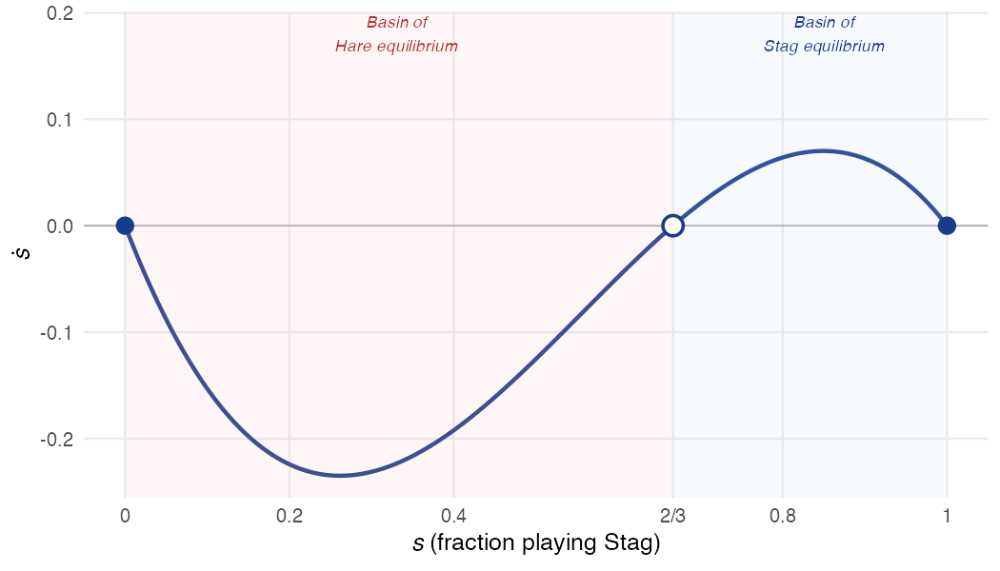
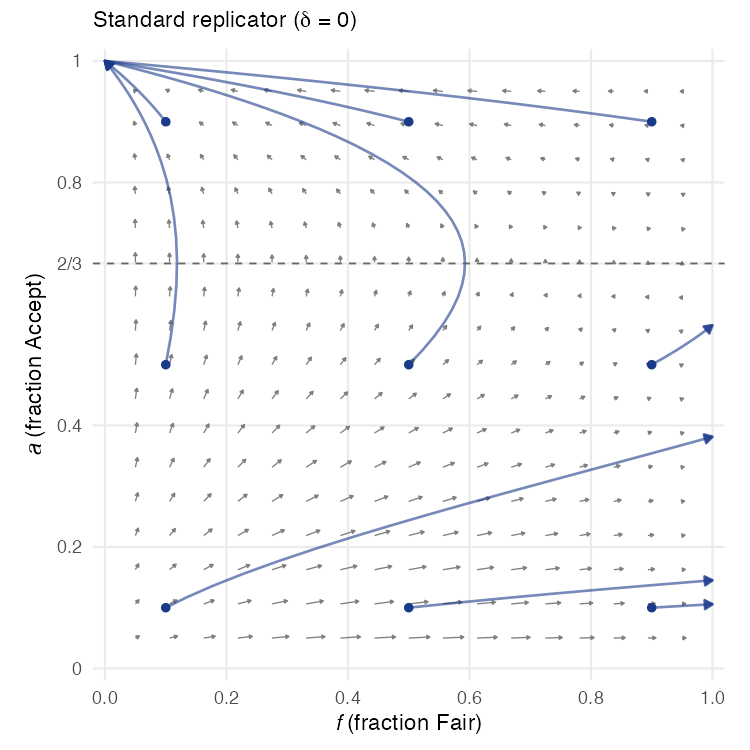
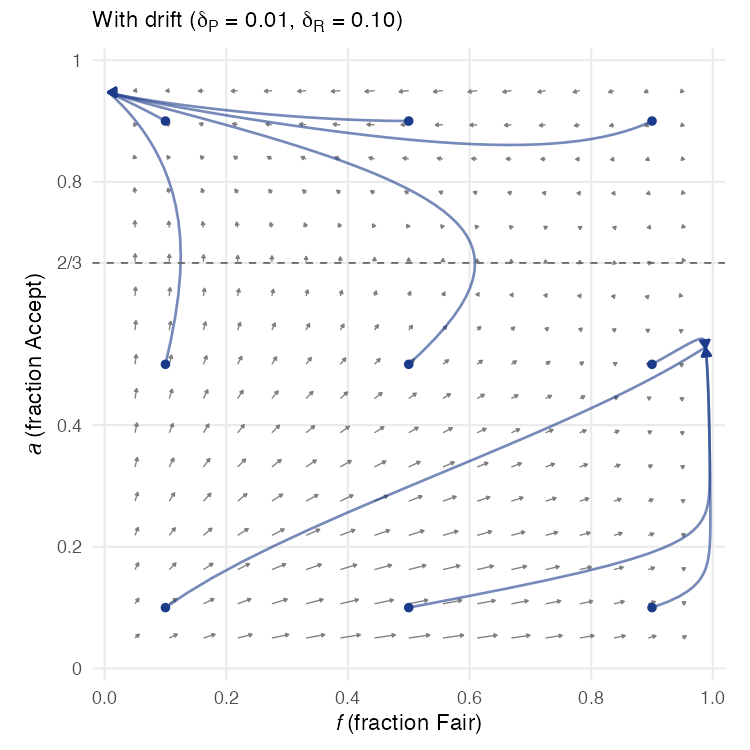
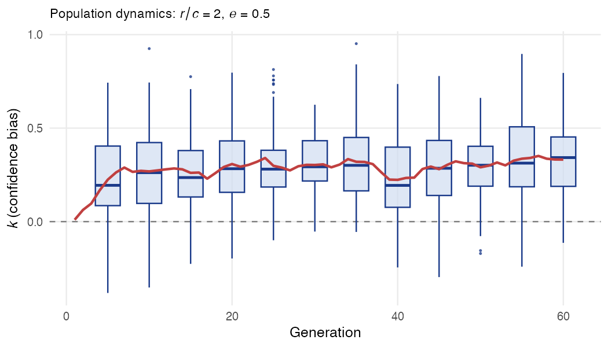
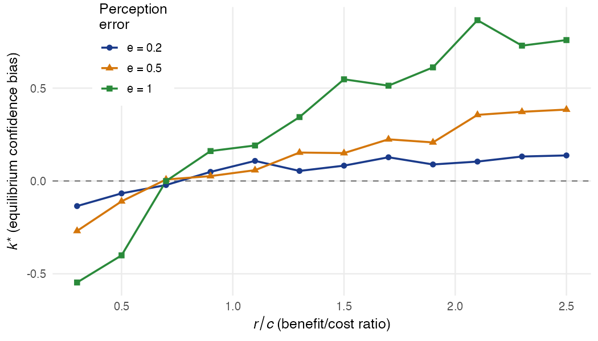

# Evolutionary Game Theory Lab

R notebook for POLI 215 (Introduction to Game Theory), Week 7. Three simulations that illustrate how evolutionary dynamics select among equilibria.

## Setup

Install the required packages:

```r
install.packages(c("ggplot2", "deSolve"))
```

Then open `evolutionary_games_lab.Rmd` in RStudio and knit it, or run:

```r
rmarkdown::render("evolutionary_games_lab.Rmd")
```

---

## 1. Stag Hunt: Replicator Dynamics

The Stag Hunt has two pure-strategy Nash equilibria (all-Stag and all-Hare) and a mixed-strategy equilibrium at $s = 2/3$. The replicator equation describes how the fraction $s$ playing Stag evolves in a large population:

$$\dot{s} = s(1-s)(3s - 2)$$

```r
s <- seq(0, 1, length.out = 500)
sdot <- s * (1 - s) * (3 * s - 2)
```



The MSNE at $s = 2/3$ is **unstable** — it's the boundary between basins of attraction. Initial conditions below $2/3$ converge to all-Hare; above $2/3$ converge to all-Stag. The risk-dominant equilibrium (Hare) has the larger basin.

**Stability check:** Expand $\dot{s} = -3s^3 + 5s^2 - 2s$ and differentiate:

$$\frac{d\dot{s}}{ds} = -9s^2 + 10s - 2$$

```r
slope_at <- function(s) -9 * s^2 + 10 * s - 2

slope_at(0)    # -2  (stable)
slope_at(2/3)  # +2/3 (unstable)
slope_at(1)    # -1  (stable)
```

---

## 2. Mini-Ultimatum Game: Two-Population Replicator

A proposer offers Fair (2, 2) or Greedy (3, 1). Responders Accept or Reject greedy offers (rejection gives 0, 0). Two populations evolve via coupled replicator equations:

$$\dot{f} = f(1-f)(2 - 3a), \qquad \dot{a} = a(1-a)(1 - f)$$

where $f$ = fraction playing Fair and $a$ = fraction playing Accept.

The notebook builds three functions step by step:

- **`arrow_field()`** — computes the vector field over a grid
- **`sim_trajectory()`** — integrates the ODE from a starting point using `deSolve::ode()`
- **`make_phase()`** — combines arrows and trajectories into a phase diagram

### Standard replicator

```r
make_phase(delta_P = 0, delta_R = 0)
```



All trajectories converge to (Greedy, Accept) — the subgame perfect equilibrium.

### With drift (experimentation)

Adding small experimentation rates ($\delta_P = 0.01$, $\delta_R = 0.10$) modifies the dynamics:

$$\dot{f} = (1-\delta_P)\, f(1-f)(2-3a) + \delta_P(1/2 - f)$$

```r
make_phase(delta_P = 0.01, delta_R = 0.10)
```



A second attractor emerges — a "fairness norm" sustained by the threat of rejection.

---

## 3. Evolution of Overconfidence

Based on a simplified version of [Johnson & Fowler (2011)](https://doi.org/10.1038/nature10384). Two individuals compete over a resource. Each has a **confidence bias** $k$: they perceive their own capability as $h_i + k$ instead of $h_i$.

The notebook builds two functions:

- **`compute_fitness()`** — Monte Carlo evaluation of an agent's expected payoff against a population

```r
compute_fitness <- function(k_i, k_j_vec, r, c_cost, e, n_pairs = 2000) {
  # For each trial:
  #   Draw capabilities h_i, h_j ~ N(0, 0.5)
  #   i claims if (h_i + k_i) > (h_j + n_i)  [biased perception]
  #   If both claim, higher actual h wins: winner gets r-c, loser gets -c
  #   If only i claims: i gets r (uncontested)
  ...
}
```

- **`evolve_population()`** — runs the evolutionary simulation (fitness-proportional replication with mutation)

### Population dynamics

With $r/c = 2$ (resources worth fighting over), overconfidence evolves within ~20 generations:



### Equilibrium bias vs. benefit/cost ratio

Sweeping over $r/c$ for different levels of perception error $e$:



When resources are valuable ($r/c$ high), overconfidence pays off — you claim uncontested resources. When conflict is costly ($r/c$ low), underconfidence evolves instead.

---

## Summary

| Simulation | Key Takeaway |
|---|---|
| **Stag Hunt** | The MSNE is the basin boundary — evolution selects *between* equilibria based on initial conditions |
| **Mini-Ultimatum** | The SPE (Greedy, Accept) is the only attractor without drift; experimentation can stabilize fairness |
| **Overconfidence** | Natural selection favors overconfidence when resources are valuable relative to conflict costs |

## References

- Carpenter, J. & Robbett, A. *Game Theory and Behavior*, Chapters 24–25.
- Johnson, D. D. P. & Fowler, J. H. (2011). The evolution of overconfidence. *Nature*, 477, 317–320.
- Maynard Smith, J. & Price, G. R. (1973). The logic of animal conflict. *Nature*, 246, 15–18.
